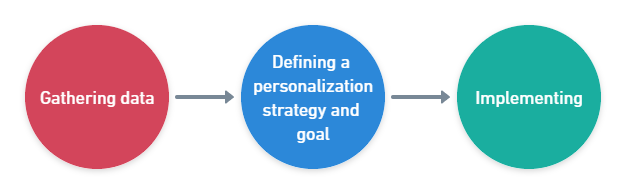

Powered by [Croct](https://croct.com/) (simulating)

[About Croct](About.md)
### Table of contents
- [Introduction :speech_balloon:](#introduction-speech_balloon)
- [New in development? :computer:](#new-in-development-computer)
  - [About CQL :mag:](#about-cql-mag)
- [Implementation process :round_pushpin:](#implementation-process-round_pushpin)
  - [Environment preparation :gear:](#environment-preparation-gear)
    - [How to connect to the API using codepen?](#how-to-connect-to-the-api-using-codepen)
  - [Step :one: - Gathering data :bar_chart:](#step-one---gathering-data-bar_chart)
  - [Step :two: - Defining a personalization strategy and goal :dart:](#step-two---defining-a-personalization-strategy-and-goal-dart)
  - [Step :three: - Implementing :wrench:](#step-three---implementing-wrench)
- [Satisfaction survey and integration time :star:](#satisfaction-survey-and-integration-time-star)


# Introduction :speech_balloon:
Documentation designed for developers to facilitate integration with Croct. This documentation aims to detail all the steps, in order to make simple and intuitive all the interaction that needs to have between the system that will communicate with Croct's API
# New in development? :computer:
Croct created a programming language for non-developers! It's called CQL (Contextual Query Language).

Works intuitively to ease the learning curve for anyone unfamiliar with programming languages or markup languages

Three types of areas (Marketing, Product, and Engineering) can use Croct to drive revenue with more targeted messaging and to increase short-term customer lifetime value
## About CQL :mag:
An intuitive query language that allows anyone, **even those who never touched code before**, to query information and make decisions without dealing with code, data processing, or other complicated stuff.

It's like [SQL](https://www.w3schools.com/sql/), but for non-developers. Here are some examples that can be used for CQL with Croct:
* Time
  ```js
    Today
    //Sample result: "2022-05-09"
    ```
* Location
   ```js
    Location's city
    //Sample result: "New York"
   ```
* Stats
  ```js
  User's stats' sessions
  // 5
  ```
# Implementation process :round_pushpin:
The implementation process consists of only three steps. This flow is for all cases.

## Environment preparation :gear:
First of all it is necessary to have all the details aligned to connect to the API, here are some ways to make the connection:
### How to connect to the API using [codepen](https://codepen.io/pen)?
1. [Open the playground](http://play.croct.com/)
2. Click on the "Don't have an API Key?" link to proceed in sandbox mode
3. Enter the URL https://codepen.io/pen
4. Click on "Let's play!"
5. Finally, click on the button labeled "codepen.io/pen" at the top right of the page

## Step :one: - Gathering data :bar_chart:
It consists of gathering the information that will feed the personalization engine and **it is common to all the other steps**
## Step :two: - Defining a personalization strategy and goal :dart:
This is the time to define the audience, whether it is an experiment or not (such as an A/B test), decide what will be personalized, and what metrics will help measure the result of the personalization
## Step :three: - Implementing :wrench:
In this last step the implementation of personalization happens, and eventually the tracking to measure the results.

# Satisfaction survey and integration time :star:
Please take 5 minutes of your time to fill out our satisfaction survey and integration time :link:[here](https://pt.surveymonkey.com/r/DX3KQ3H). This survey is so we can find our shortcomings and improve our work to better serve you.